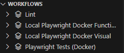

# Playwright Python SauceDemo Testing Suite

This repository contains a comprehensive suite of automated tests for the SauceDemo website, built using [Playwright](https://playwright.dev/python/) and Python. The tests cover both functional and visual testing, ensuring the website's functionality and UI consistency across multiple browsers - Chromium, Firefox and Webkit.

## Table of Contents

- [Features](#features)
- [Prerequisites](#prerequisites)
- [Setup](#setup)
- [Running Tests](#running-tests)
  - [Functional Tests](#functional-tests)
  - [Visual Tests](#visual-tests)
- [Docker Integration](#docker-integration)
- [Reports](#reports)
- [Support of Act](#support-of-act)

## Features

- **Functional Testing**: Validates the core functionality of the SauceDemo website.
- **Visual Testing**: Ensures UI consistency using snapshot comparisons.
- **Cross-Browser Testing**: Supports Chromium, Firefox, and WebKit.
- **Dockerized Environment**: Simplifies test execution with pre-configured Docker images.
- **CI/CD Integration**: Automated workflows for GitHub Actions.

## Prerequisites

Ensure the following are installed on your system:

- Python 3.10 or higher
- Docker (for containerized test execution)

## Setup

1. Clone the repository:
   ```bash
   git clone https://github.com/your-username/playwright-python-saucedemo.git
   cd playwright-python-saucedemo
   ```

2. Install dependencies:
   ```bash
   pip install -r requirements.txt
   ```

3. Install Playwright browsers:
   ```bash
   playwright install
   ```

## Running Tests

### Functional Tests

Run functional tests using the following command:
```bash
pytest tests/tests_ui/
```

### Visual Tests

Run visual tests and generate snapshots:
```bash
pytest tests/tests_visual/
```

To run tests for all supported browsers:
```bash
pytest tests/tests_visual/ --browser chromium --browser firefox --browser webkit
```

## Docker Integration

Build and run tests in a Docker container:

1. Build the Docker image:
   ```bash
   docker build -t saucedemo .
   ```

2. Run tests in the container:
   ```bash
   docker run --rm -v $(pwd)/test_results:/app/test_results saucedemo pytest tests/tests_ui/
   ```

## Reports

Test reports are generated in the `reports/` directory. Open the HTML files in a browser to view detailed results:

- `Test Report - Chromium.html`
- `Test Report - Firefox.html`
- `Test Report - Webkit.html`

## Support of Act

This project supports the use of [Act](https://github.com/nektos/act) to run GitHub Actions locally. Act allows you to test and debug your CI/CD workflows without pushing changes to GitHub.

### Running Workflows Locally

1. Install Act by following the instructions in the [Act documentation](https://github.com/nektos/act#installation).

2. Run the desired workflow using the following command:
   ```bash
   act -j <job-name>
   ```
   Replace `<job-name>` with the name of the job you want to execute, as defined in your GitHub Actions workflow file.

3. To simulate different GitHub events, use the `-e` flag to specify an event file:
   ```bash
   act -e <event-file>
   ```
   Replace `<event-file>` with the path to a JSON file representing the GitHub event payload.

### Using Act with Visual Studio Code

To enhance your experience with Act, you can use it in combination with the Visual Studio Code plugin for GitHub Local Actions. This allows you to:

- View and edit your GitHub Actions workflows directly in VS Code.
- Run Act commands from the integrated terminal.
- Debug workflows with ease.

#### Steps to Use Act with VS Code

1. **Install the GitHub Local Actions Plugin**:
   - Open the Extensions view in VS Code (`Ctrl+Shift+X` or `Cmd+Shift+X` on macOS).
   - Search for "GitHub Local Actions" and install the plugin.

2. **Run Act Commands from VSC**:
   - Click on the new icon on your side bar.
   - Make sure that all components are green (act is installed and Docker Engine is running). If not, hover over them and they will guide on how to make them work.
   
   - All your workflows should be automatically discovered and shown in `Workflows` section.
   
   - You can run the workflow by pressing green Run button next to workflow's name.
   
   - In this project workflows that start with "Local [...]" are meant to run with Act
   - Afterwards every workflow you executed should be visible in `History` section.
   
   - And you should have access to the whole output of the workflow as a separate file by clicking the book icon.
   

3. **Known Issues:**
   - For some reason the Lint job sometimes gets stuck and won't ever finish. In that case just cancel and run it again, the `Run linters` step should not take longer than 30s.